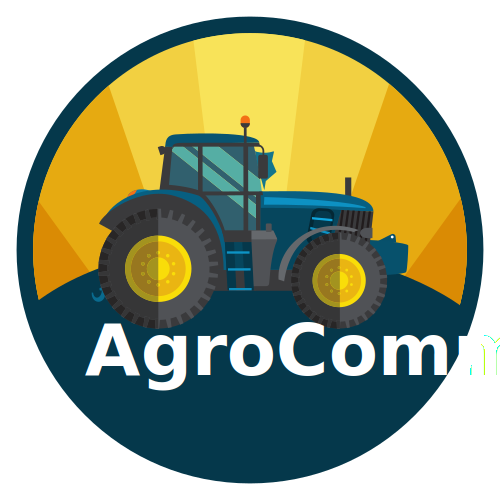

# AgroComm (Monorepo)

  

- [AgroComm](https://github.com/sistematico/agrocomm/tree/main/apps/site) | [Site](https://agrocomm.com.br)
- [AgroComm API](https://github.com/sistematico/agrocomm/tree/main/apps/api) | [Site](https://api.agrocomm.com.br)

## Banco de Dados

## Dependências

- [Bun](https://bun.sh)
- [Drizzle ORM](https://prisma.io)
- [Vite](https://vitejs.dev)
- [Vue.js](https://vuejs.org)
- [Hono](https://hono.dev)
- [Twitter Bootstrap](https://getbootstrap.com)

## 📰 Referências

- [https://bun.sh/guides/install/workspaces](https://bun.sh/guides/install/workspaces)
- [https://bun.sh/docs/cli/install#workspaces](https://bun.sh/docs/cli/install#workspaces)
- [https://bun.sh/docs/install/workspaces](https://bun.sh/docs/install/workspaces)
- [https://github.com/colinhacks/bun-workspaces](https://github.com/colinhacks/bun-workspaces)
- [https://docs.npmjs.com/cli/v10/using-npm/workspaces](https://docs.npmjs.com/cli/v10/using-npm/workspaces)

## 🕐 ChangeLog

- `2024/10/28` - Commit inicial

This project was created using `bun init` in bun v1.1.33.
[Bun](https://bun.sh) is a fast all-in-one JavaScript runtime.
