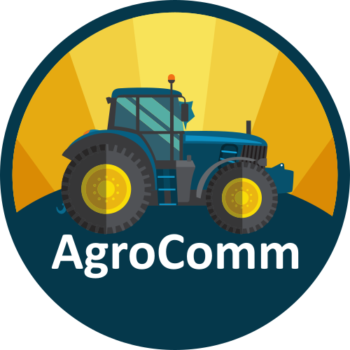

# AgroComm

  

## Ecossistema

| Seção | Produção | Repositório | 
| --- | --- | --- | 
| Frontend | https://agrocomm.com.br | https://github.com/sistematico/agrocomm/tree/main/apps/site |
| Backend | https://api.agrocomm.com.br | https://github.com/sistematico/agrocomm/tree/main/apps/api |

## Stack

| --- | --- | 
| Banco de Dados | [Drizzle ORM](https://orm.drizzle.team/) | 
| API | [Bun](https://bun.sh) & [Hono](https://hono.dev) |
| Front | [Vue.js](https://vuejs.org), [Vite](https://vite.dev/) & [Tailwind CSS](https://tailwindcss.com) |
| Scrapping | [Cheerio](https://cheerio.js.org/) |

## Dependências

- [Bun](https://bun.sh)
- [Drizzle ORM](https://prisma.io)
- [Vite](https://vitejs.dev)
- [Vue.js](https://vuejs.org)
- [Hono](https://hono.dev)
- [Tailwind CSS](https://tailwindcss.com)
- [Cheerio](https://cheerio.js.org/)

## 📰 Referências

- [https://bun.sh/guides/install/workspaces](https://bun.sh/guides/install/workspaces)
- [https://bun.sh/docs/cli/install#workspaces](https://bun.sh/docs/cli/install#workspaces)
- [https://bun.sh/docs/install/workspaces](https://bun.sh/docs/install/workspaces)
- [https://github.com/colinhacks/bun-workspaces](https://github.com/colinhacks/bun-workspaces)
- [https://docs.npmjs.com/cli/v10/using-npm/workspaces](https://docs.npmjs.com/cli/v10/using-npm/workspaces)

## Temas e configurações

- [VSCode](https://code.visualstudio.com/)
  - [Monokai](https://marketplace.visualstudio.com/items?itemName=monokai.theme-monokai-pro-vscode)

## 🕐 ChangeLog

- `2024/10/28` - Commit inicial

This project was created using `bun init` in bun v1.1.33.
[Bun](https://bun.sh) is a fast all-in-one JavaScript runtime.
